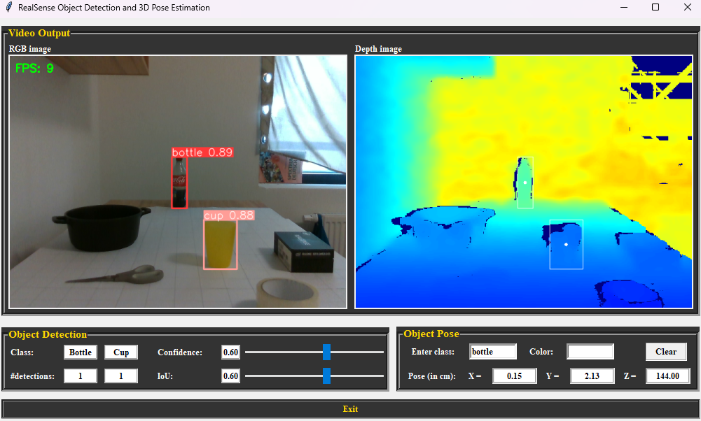
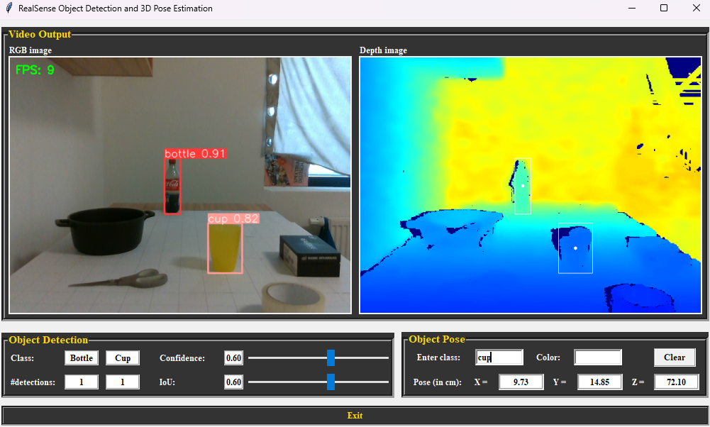
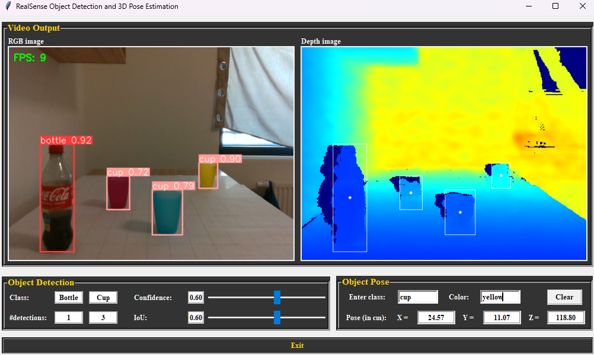

# 3D Object Pose Detector
This is an educational project serving as a bachelor's thesis on the topic of 3D object pose measurement, comprising of three main sections:
- Filtering the annotation JSON file of the COCO dataset for attaining a custom dataset of vital objects only
- Training the YOLOv5 model on the obtained dataset with fine-tuning parameters for optimized performance and testing on real cases of images captured from the Intel RealSense depth camera.
- Developing a module that feeds the RGB image of the camera into the detection model. The predicted bounding boxes are then aligned concerning the depth frame for computing the 3D pose of the detected objects.

In this file, an explicit operating guideline for the entire project alongside possible outcomes of the current work on image acquisition and object pose detection are represented. 

<h1 align="center">Documentations</h1>

## Install
Clone repo and install [requirements.txt](./yolov5-with-realsense/requirements.txt) in a Python>=3.8.0 environment, including PyTorch>=1.8.

```
git clone https://github.com/hungdothanh/object-pose-detector.git  # clone
cd object-pose-detector/yolov5-with-realsense
pip install -r requirements.txt  # install
```


## Dataset Preparation
Download the COCO annotation file.
```
wget http://images.cocodataset.org/annotations/annotations_trainval2017.zip
unzip annotations_trainval2017.zip
```

Filter the obtained COCO Instances JSON file by categories. 
The command below will filter the input instances JSON to contain only images and annotations for the chosen categories (e.g. bottle, cup), noting that those images include at least one of the specified categories.
```
cd object-pose-detector/coco-manager
python filter.py --input_json "./instances_train2017.json" --output_json "./filtered.json"
```

Download filtered images from COCO open-source for train and validate set and create labels for object bounding boxes. Noting also there will be asked to download the entire set or only a specified number of images.
```
mkdir dataset/custom-set/train&val
python download.py --input_json "./filtered.json" --save_dir "./dataset"
```

Create the data configuration file in YAML format for the training process.
```
python data_yaml.py --input_json "./filtered.json" --train_dir "./dataset/train/images" --val_dir "./dataset/val/images" --save_dir "/object-pose-detector/yolov5-with-realsense/data"
```


## Training
Install the correct pytorch-cuda compatible version (pytorch 2.1.1 for CUDA version 12.0 or 12.1)
```
pip3 install torch torchvision torchaudio --index-url https://download.pytorch.org/whl/cu121
```

The training from scratch is executed by the following command with the default YOLOv5s model (can be modified) and data configuration file created above.
(Note: --device 0 if gpu else cpu)
```
cd object-pose-detector/yolov5-with-realsense
python train.py -- weights "" --cfg yolov5s.yaml --data ".\dataset\data.yaml" --batch-size 128 --epochs 100 --img-size 640 --device 0
```


## Inference
Execute the real-time object detection and 3D pose estimation tasks on the Intel RealSense depth camera by the command below (here pre-trained weight and data configuration file for bottle-cup dataset is imported):
- GUI compatible for 2 categories 'bottle, cup' only:
```
cd object-pose-detector/yolov5-with-realsense
python pose-detect-with-realsense.py --weight "weights/bottle-cup-yolov5s.pt" --data "data/bottle-cup-data.yaml --device 0"
```

- GUI compatible for more categories of detections:
  (The pretrained model being used here comprises of 5 classes 'person, bottle, wine glass, cup, chair')
```
python pose-detect-with-realsense-0.py --weights "runs/train/thesis-exp/weights/best.pt" --data "runs/train/thesis-exp/data.yaml" --device 0
```

<h1 align="center">Proof of Concept</h1>
Below are multiple outcomes for a detection of object's pose using the proposed program.
- A single bottle amongst different indoor objects:


<br/>
- A single cup amongst different indoor objects:


<br/>
- A yellow cup amongst other detected cups:

